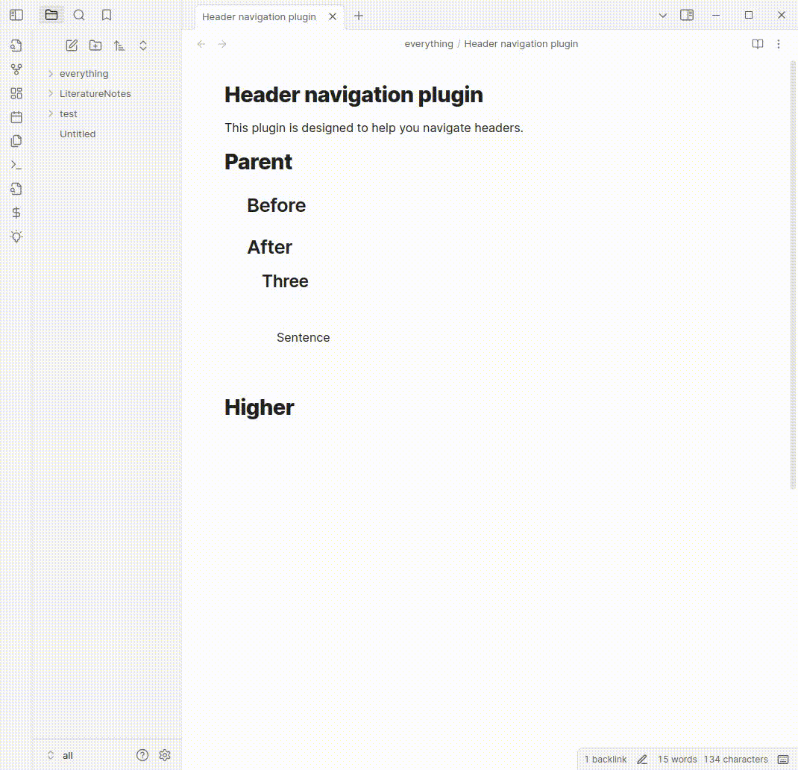

# Header navigation plugin

This is a header navivation for the markdown editor called Obsidian.
This plugin lets you quickly navigate between headers and fold them.
It provides a command to toggle folding of a header.

It is a third party plugin and has no affiliation with obsidian.

# Installation
This plugin should be available through obsidian community plugins.

Alternatively you can install it directly by

1. Cloning the git repository into `.obsidian/plugins` in your vault
1. Running `npm install`, `npm run dev` in the repository
1. Reloading obsidian
1. Enabling the plugin in the community plugins tab of settings.

# Using
Press C-P to open the command palette and search for "header nagivation".
This will show the commands that this plugin provides.

I would suggest binding these commands to hotkeys. You might find a plugin like [sequence hotkeys](https://github.com/moolmanruan/obsidian-sequence-hotkeys) useful, this allows you to define a "prefix" key such as C-m for motion commands so you can then assing C-m Up etc for moving around headers.

# Influences and related tools
This is very much influenced by the functions provided by emacs <a href="https://orgmode.org/">org-mode</a>

This project uses the [remark](https://github.com/remarkjs/remark/) markdown parser and its source code is included (under and MIT license) within the js output.

[Quiet outline](https://github.com/guopenghui/obsidian-quiet-outline) provides a sidebar tool similar to a "code browser" that allows you to perform similar motions with a mouse, and well as reorder headings.

# About me
I make productivity tools and AI tools related to reading and research.
If that sounds interesting you can follow me on <a href="https://x.com/readwithai">twitter</a> or <a href="https://bsky.app/profile/readwithai.bsky.social">bluesky</a>.

I write about these topics on <a href="https://readwithai.substack.com/readwithai">substack</a>.

If you find *this* piece of software useful. Maybe give me money (like $2 dollars?) on my <a href="https://ko-fi.com/readwithai">kofi</a>.
